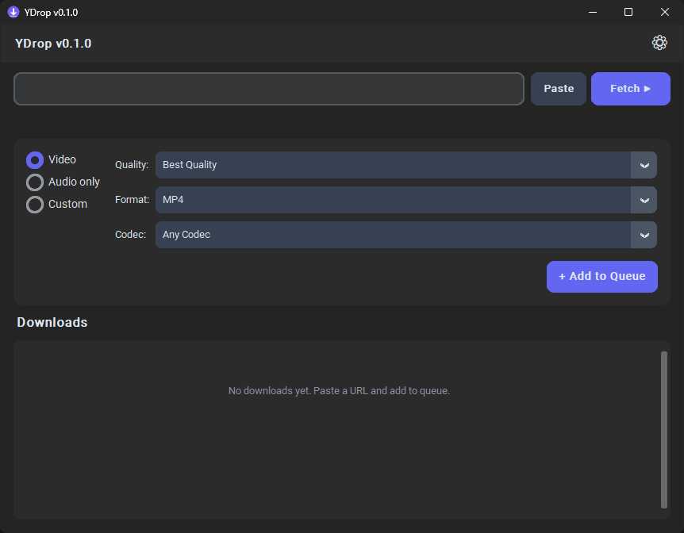

# YDrop

> A clean, modern desktop GUI for yt-dlp on Windows. Download video and audio from YouTube and 1800+ sites — no command line required.



## Features

- **One-click downloads** — paste a URL, pick a format, hit download
- **Video & audio** — MP4 up to best quality, MP3/FLAC/OGG audio extraction
- **Download queue** — parallel downloads with live progress, speed, and ETA
- **Playlist support** — download entire playlists or single videos
- **Thumbnails** — live thumbnail previews in download cards
- **Auto FFmpeg** — detects FFmpeg on PATH or auto-downloads a portable copy
- **Themes** — Dark, Light, or System (auto-detect from Windows settings)
- **Portable .exe** — single-file executable, no Python needed for end users
- **Open source** — MIT licensed

## Download

Grab **YDrop.exe** from the [Releases](../../releases) page. No Python installation required.

## Developer Setup

```bash
python -m venv venv
venv\Scripts\activate
pip install -r requirements.txt
python main.py
```

## Build .exe

*Note: Make sure you have completed the **Developer Setup** first so the `venv` folder exists.*

```bash
build.bat
```

Output: `dist/YDrop.exe`

## Supported Sites

YDrop supports all sites supported by yt-dlp — over 1800 and counting.  
Full list: [yt-dlp supported sites](https://github.com/yt-dlp/yt-dlp/blob/master/supportedsites.md)

## Roadmap / Future Plans

While YDrop is currently completely optimized for Windows, the underlying tech stack is entirely cross-platform. Future updates are planned to introduce:
- **macOS support** (Universal `.app` bundle)
- **Linux support** (AppImage / Flatpak)
- Cross-platform auto-FFmpeg downloading

## License

MIT — see [LICENSE](LICENSE) for details.
